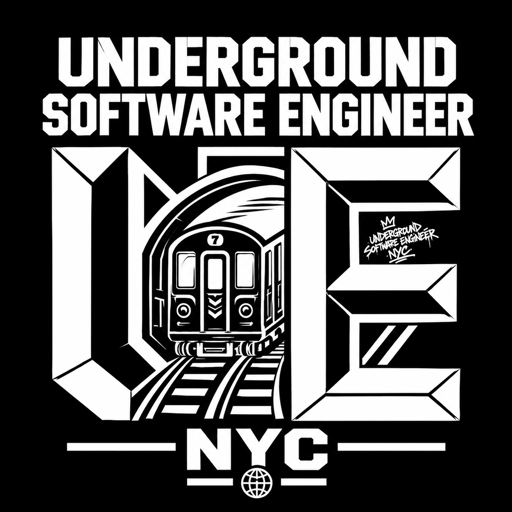

<p align="center">
  
</p>

# UNDERGROUND SOFTWARE ENGINEERS — NYC

**An NYC engineering crew. Any software for the web, any language. AI-driven development first.**

> AI generates. Engineers decide.

We build web software on whatever stack the job demands. The machine writes at full
speed; someone still has to know where the tracks go. We run the work the way the city
runs trains: lines, switches, signals, transfers.

## What that means

- **Engineers first.** AI output is a starting gun, not a deliverable. An engineer decides
  what should exist, where it belongs, and what happens when a signal goes red.
- **We run what we build.** Our artifact system, our link engine, our tooling — built,
  signed, and operated in-house.
- **The city is the network.** The work ships to the street, not just to a dashboard.

## The door is physical

The main site is gated. Entry is a signed artifact — a QR code living in the city — and
it verifies itself in your browser before anything renders. No forms. No preview.

```
ARTIFACT IN THE FIELD → SCAN → DECODER VERIFIES → THE SITE OPENS
```

Refuse an artifact and the decoder tells you why — and where the live ones are.

## The surfaces

| Surface | What it is |
| --- | --- |
| [The main site](https://underground-engineer-nyc.myfilebase.site/) | The presentation. Gated. The signal is buried in its code. |
| [The hiring hall](https://github.com/underground-software-engineers-nyc/underground-engineer-NYC-job-board) | Where you apply. GitHub issues and PRs — one door. |

Everything else in this org is either crew-side or infrastructure.

## Want in

A quest is buried in the main site's code. Solve it and you hold the one application
channel. The crew reads every application.

Accepted engineers mint and distribute their own signed artifacts across the city —
every scan credits their handle — and work reaches them through the hall.

## This repo

The org's public front. `index.html` is a static page — no build step, no trackers.
`brand/` holds the emblem and its derived icons. `llms.txt` is the machine-readable
summary for agents and crawlers.

---

*BUILT UNDERGROUND. SHIPPED TO THE STREET.*
